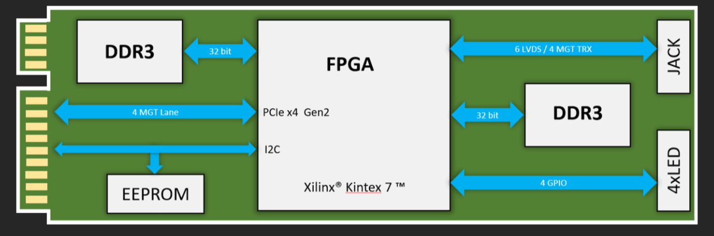

# nvx.facc-k7

**Modular FPGA-based signal processing and AI acceleration platform (Kintex-7 + DDR3) — by Novexum™**

  
  

---

## 🔍 Overview

**NVX.FACC-K7** is a high-performance FPGA-based Storage and Processing Computing Module (SPCM),  
designed to accelerate AI, DSP, and edge computing in embedded platforms or servers.  
With its modular architecture based on Kintex-7 and high-speed DDR3 memory, the NVX.FACC-K7 delivers  
powerful computation in a compact M.2 form factor.

---

## 📸 Photos

  
*Front view of NVX.FACC-K7 module*

  
*Angled view of NVX.FACC-K7 module*

  
*Installed on development board*

---

## 🧬 Architecture

---

## ⚙️ Specifications

- **FPGA**: AMD® Kintex-7™ XC7K325T (others available on request)
- **DDR3 Memory**:
  - Two x32 DDR3 SDRAM banks
  - Standard: 8GB (16GB variant optional)
  - Up to 1066 MT/s transfer rate
- **Interfaces**:
  - PCIe Gen2 x4 via expanded M.2 2280
  - 4 GPIO
  - JTAG access
  - LED status indicators
  - Jack with MGT/clock I/O

---

## 🚀 Applications

- AI / DSP / DPU acceleration  
- Computational iStorage  
- signal intelligence backends  
- Embedded RISC-V / softcore prototyping  
- Custom accelerator research

---

## 📜 License

This repository is released under the **Apache License 2.0**.  
See [`LICENSE`](./LICENSE) for details.

> ⚠️ The names **Novexum**, **nvx.facc**, and the Novexum™ logo are trademarks. See [`TRADEMARK.md`](./TRADEMARK.md) for usage policy.

---

## 🤝 Partner With Us

I am seeking partners, contributors, and early adopters.  
If you're building next-gen compute platforms — let’s collaborate.

---

© 2025 Konstantin Tiutin / Novexum. All rights reserved.
